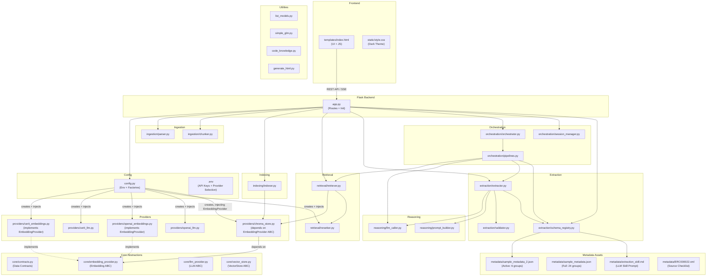

# 🌿 Document Research Assistant — Complete Working Tree

**Repository:** `BioIT-CEITEC/document-research-assistant`
**Generated:** May 2026

---

## Architecture Overview



---

## Directory Tree — Annotated

```
code/
│
├── .env                              # API keys + provider selection (gitignored)
├── .gitignore                        # Standard Python gitignore
├── README.md                         # Project description (brief)
├── requirements.txt                  # All pinned dependencies
│
├── app.py                            # ⭐ Flask application — routes, singletons, startup
├── config.py                         # ⭐ Configuration — env vars + factory methods
│
├── list_models.py                    # Utility: discover CERIT models + test embeddings
├── simple_glm.py                     # Utility: quick GLM-5.1 chat test
├── code_knowledge.py                 # Utility: Tree-sitter AST → code_graph.json
├── generate_html.py                  # Utility: Graphify visualization of code graph
│
├── field_derivability_assessment.json # Pre-computed: Directly Available / Inferable / Not Obtainable
├── code_graph.json                   # Generated by code_knowledge.py (AST structural graph)
│
├── documents/                        # Upload target directory (created at runtime)
├── vector_store/                     # ChromaDB persistent storage (created at runtime)
│
├── core/                             # ═══ ABSTRACTION LAYER ═══
│   ├── __init__.py
│   ├── contracts.py                  # ⭐ All dataclasses (Chunk, RetrievalResult, FieldExtraction, etc.)
│   ├── embedding_provider.py         # ABC: embed(texts) → List[List[float]] + dimension
│   ├── llm_provider.py               # ABC: complete() + stream()
│   └── vector_store.py               # ABC: create_collection, add, query, delete, count, get
│
├── providers/                        # ═══ PROVIDER IMPLEMENTATIONS ═══
│   ├── __init__.py
│   ├── cerit_embeddings.py           # CeritEmbeddingProvider — CERIT API, KNOWN_DIMENSIONS dict
│   ├── cerit_llm.py                  # CeritLLMProvider — OpenAI-compatible chat, no json_mode
│   ├── openai_embeddings.py          # OpenAIEmbeddingProvider — text-embedding-3-small, 1536-dim
│   ├── openai_llm.py                 # OpenAILLMProvider — supports json_mode
│   └── chroma_store.py              # ⭐ ChromaVectorStore — CustomEmbeddingFunction wrapper, distance→score
│
├── ingestion/                        # ═══ DOCUMENT INGESTION ═══
│   ├── __init__.py
│   ├── parser.py                     # DocumentParser — PDF (PyMuPDF), DOCX (python-docx), TXT (chardet)
│   └── chunker.py                    # ⭐ Chunker — section-aware, heading detection, 600-token target
│
├── indexing/                          # ═══ VECTOR INDEXING ═══
│   ├── __init__.py
│   └── indexer.py                    # Indexer — batch embed+store into ChromaDB, progress callback
│
├── retrieval/                         # ═══ SEARCH & RERANKING ═══
│   ├── __init__.py
│   ├── retriever.py                  # ⭐ Retriever — semantic, keyword (BM25), field-aware, hybrid (RRF)
│   └── reranker.py                   # CeritReranker — /rerank endpoint, graceful fallback
│
├── extraction/                        # ═══ METADATA EXTRACTION ═══
│   ├── __init__.py
│   ├── extractor.py                  # ⭐ MetadataExtractor — per-group or single-pass extraction
│   ├── schema_registry.py            # SchemaRegistry — loads JSON schema + skill, builds maps + index
│   └── validator.py                  # Validator — fuzzy vocab matching, null normalization, evidence check
│
├── reasoning/                         # ═══ LLM INTERACTION ═══
│   ├── __init__.py
│   ├── llm_caller.py                 # LLMCaller — thin adapter (complete + stream)
│   └── prompt_builder.py             # ⭐ PromptBuilder — 6 prompt templates (QA, hybrid, extraction, etc.)
│
├── orchestration/                     # ═══ PIPELINE ORCHESTRATION ═══
│   ├── __init__.py
│   ├── orchestrator.py               # Orchestrator — mode detection + pipeline routing
│   ├── pipelines.py                  # ⭐ 4 pipelines: QA, Extraction, Hybrid, Completion
│   └── session_manager.py            # SessionManager — create/update/clear session state
│
├── metadata/                          # ═══ SCHEMA & SKILL ASSETS ═══
│   ├── ERC000022.xml                 # Source EMBL-EBI checklist XML
│   ├── extraction_skill.md           # ⭐ LLM skill instructions for implicit field recognition
│   ├── sample_metadata.json          # Full schema: 24 groups, ~100+ fields
│   └── sample_metadata_2.json        # ⭐ Active schema: 6 groups (subset used in production)
│
├── templates/                         # ═══ FRONTEND ═══
│   └── index.html                    # ⭐ Single-page app — chat + metadata panel, SSE streaming
│
├── static/                            # ═══ STYLES ═══
│   └── style.css                     # Dark theme, Inter font, responsive layout
│
└── explanation_md_files/              # ═══ DESIGN DOCUMENTATION ═══
    ├── implementation_plan_v2.md      # Phase 2 (chunker) + Phase 3 (reranker) plans
    └── cerit_embedding_migration.md   # Migration plan: OpenAI → CERIT embeddings
```

---

## File-by-File Detail

### `app.py` — Flask Application Entry Point

**Singletons initialized at startup:**
```
schema_registry  = SchemaRegistry()       → loads sample_metadata_2.json + extraction_skill.md
llm_provider     = config.get_llm_provider()   → CeritLLMProvider (glm-5.1) or OpenAI
vector_store     = config.get_vector_store()   → ChromaVectorStore + CeritEmbeddingProvider
llm_caller       = LLMCaller(llm_provider)
parser           = DocumentParser()
chunker          = Chunker()
indexer          = Indexer(vector_store)
reranker         = config.get_reranker()       → CeritReranker (qwen3-reranker-4b)
retriever        = Retriever(vector_store, reranker)
validator        = Validator(schema_registry)
extractor        = MetadataExtractor(schema_registry, validator, llm_caller)
session_manager  = SessionManager(vector_store)
orchestrator     = Orchestrator(session_manager, retriever, extractor, llm_caller, schema_registry)
```

**Startup action:** `schema_registry.build_index(indexer)` — indexes schema fields into `schema_index` ChromaDB collection.

**API Routes:**

| Route | Method | Input | Output | Pipeline |
|---|---|---|---|---|
| `/` | GET | — | HTML page | — |
| `/api/schema` | GET | — | JSON schema | SchemaRegistry |
| `/api/upload` | POST | multipart file | SSE stream | parse→chunk→index→extract_all_single_pass |
| `/api/chat` | POST | `{message, trigger_extraction}` | SSE stream | Orchestrator→QAPipeline/ExtractionPipeline/HybridPipeline |
| `/api/suggest` | POST | `{field_name, group_name, user_context}` | SSE stream | CompletionPipeline |
| `/api/metadata/update` | POST | `{group_name, field_name, value, source}` | JSON | Direct session update |
| `/api/metadata` | GET | — | JSON metadata | Session read |
| `/api/session` | DELETE | — | JSON confirmation | SessionManager.clear_document |

---

### `config.py` — Configuration & Factories

**Environment Variables:**

| Variable | Default | Purpose |
|---|---|---|
| `LLM_PROVIDER` | `"cerit"` | `"cerit"` or `"openai"` |
| `LLM_MODEL` | `"glm-5.1"` (cerit) / `"gpt-4o"` (openai) | Chat model |
| `OPENAI_API_KEY` | — | Required if LLM_PROVIDER=openai |
| `CERIT_API_KEY` | — | Required if LLM_PROVIDER=cerit |
| `CERIT_BASE_URL` | `"https://llm.ai.e-infra.cz/v1/"` | CERIT API endpoint |
| `EMBEDDING_PROVIDER` | `"cerit"` | `"cerit"` or `"openai"` |
| `EMBEDDING_MODEL` | `"qwen3-embedding-4b"` | Embedding model name |
| `RERANKER_MODEL` | `"qwen3-reranker-4b"` | Reranker model name |

**Paths (derived from BASE_DIR):**
- `UPLOAD_FOLDER` → `documents/`
- `METADATA_DIR` → `metadata/`
- `SCHEMA_PATH` → `metadata/sample_metadata_2.json`
- `SKILL_PATH` → `metadata/extraction_skill.md`
- `VECTOR_STORE_DIR` → `vector_store/`

---

### `core/contracts.py` — Data Contracts

```
Chunk
├── text: str
├── chunk_index: int
├── source_file: str
├── section: str
├── token_count: int
└── metadata: Dict[str, Any]

RetrievalResult
├── text: str
├── section: str
├── score: float
├── source: str              # "semantic" | "keyword" | "field_aware" | "hybrid"
└── metadata: Dict[str, Any]

FieldExtraction
├── field_name: str
├── group_name: str
├── value: Optional[str]
├── evidence: Optional[str]
├── confidence: Optional[str]  # "high" | "medium" | "low"
├── inference_type: Optional[str]  # "reported" | "inferred"
├── section: Optional[str]
└── source: Optional[str]   # "auto-extracted" | "ai-suggested" | "user-provided"

FieldSuggestion
├── field_name: str
├── group_name: str
├── suggested_value: Optional[str]
├── confidence: str
├── evidence: Optional[str]
├── inference_type: str
└── alternatives: List[str]

CompletionRequest
├── session_id: str
├── field_name: str
├── group_name: str
└── user_context: Optional[str]

ExtractionDiagnostics
├── total_fields: int
├── extracted_count: int
├── null_count: int
├── warnings: List[str]
└── relevant_groups: List[str]

ExtractionResult
├── fields: Dict[str, Dict[str, FieldExtraction]]  # group → field → extraction
└── diagnostics: ExtractionDiagnostics

PipelineRequest
├── session_id: str
├── user_message: str
├── mode: str                # "interaction" | "extraction" | "hybrid"
├── schema_data: Optional[Dict]
└── extracted_metadata: Optional[Dict]

PipelineResponse
├── content: str
├── mode: str
├── metadata: Optional[ExtractionResult]
└── streaming: bool = True

DocumentSession
├── session_id: str
├── document_filename: Optional[str]
├── document_text: Optional[str]
├── chat_history: List[Dict]
├── extracted_metadata: Optional[Dict]
├── chunk_count: int = 0
└── created_at: datetime
```

---

### `providers/cerit_embeddings.py` — CERIT Embedding Provider

```
CeritEmbeddingProvider(EmbeddingProvider)
├── __init__(api_key, base_url, model_name="multilingual-e5-large-instruct")
│   └── self.client = OpenAI(api_key, base_url)
│   └── self._dimension = KNOWN_DIMENSIONS.get(model_name)
│
├── KNOWN_DIMENSIONS: Dict
│   ├── "multilingual-e5-large-instruct" → 1024
│   ├── "mxbai-embed-large:latest"       → 1024
│   ├── "nomic-embed-text-v1.5"          → 768
│   ├── "nomic-embed-text-v2-moe"        → 768
│   └── "qwen3-embedding-4b"            → 2560
│
├── embed(texts: List[str]) → List[List[float]]
│   └── client.embeddings.create(model, input=texts)
│   └── caches dimension from first response
│
└── dimension: int  (property)
    └── falls back to probe embedding → 1024 default
```

---

### `providers/cerit_llm.py` — CERIT LLM Provider

```
CeritLLMProvider(LLMProvider)
├── __init__(api_key, base_url, model)
│   └── self.client = OpenAI(api_key, base_url)
│
├── complete(messages, temperature, json_mode=False) → str
│   └── NOTE: json_mode param accepted but NOT passed to API
│   └── client.chat.completions.create(model, messages, temperature)
│
└── stream(messages, temperature) → Generator[str]
    └── client.chat.completions.create(model, messages, stream=True, temperature)
```

**⚠️ Known gap:** `json_mode` is not forwarded to CERIT API (unlike `OpenAILLMProvider` which sets `response_format`). Extraction still works because the prompt instructs JSON output, but it's not enforced at API level.

---

### `providers/openai_llm.py` — OpenAI LLM Provider

```
OpenAILLMProvider(LLMProvider)
├── __init__(api_key, model)
│   └── self.client = OpenAI(api_key)
│
├── complete(messages, temperature, json_mode=False) → str
│   └── if json_mode: create_kwargs["response_format"] = {"type": "json_object"}
│   └── client.chat.completions.create(**create_kwargs)
│
└── stream(messages, temperature) → Generator[str]
    └── client.chat.completions.create(model, messages, stream=True, temperature)
```

---

### `providers/openai_embeddings.py` — OpenAI Embedding Provider

```
OpenAIEmbeddingProvider(EmbeddingProvider)
├── __init__(api_key, model_name="text-embedding-3-small")
│   └── self.ef = OpenAIEmbeddingFunction(api_key, model_name)
│
├── embed(texts) → List[List[float]]
│   └── self.ef(texts)  # delegates to ChromaDB's built-in function
│
└── dimension: int → 1536  (hardcoded)
```

---

### `providers/chroma_store.py` — ChromaDB Vector Store

```
CustomEmbeddingFunction(EmbeddingFunction)
└── __call__(input: Documents) → Embeddings
    └── self.provider.embed(input)

ChromaVectorStore(VectorStore)
├── __init__(db_path, embedding_provider)
│   └── self.client = chromadb.PersistentClient(path=db_path)
│   └── self.embedding_function = CustomEmbeddingFunction(embedding_provider)
│
├── create_collection(name)
│   └── client.get_or_create_collection(name, embedding_function)
│
├── add(collection, documents, metadatas, ids)
│   └── col.add(documents, metadatas, ids)
│
├── query(collection, query_texts, n_results) → List[List[RetrievalResult]]
│   └── col.query(query_texts, n_results)
│   └── Converts distance → score: score = 1.0 / (1.0 + distance)
│   └── Returns [[]] on missing collection (graceful)
│
├── delete_collection(name)
├── count(collection) → int
└── get(collection, limit=None) → Dict
```

**Score conversion:** ChromaDB returns cosine *distance* (0 = identical). The conversion `1/(1+distance)` maps: distance 0 → score 1.0, distance 1 → score 0.5, distance ∞ → score 0.

---

### `ingestion/parser.py` — Document Parser

```
DocumentParser
├── MAX_FILE_SIZE_MB = 10
│
├── parse(file_path, filename) → (text, error)
│   ├── PDF  → _extract_from_pdf()  [PyMuPDF/fitz, page-by-page]
│   ├── DOCX → _extract_from_docx() [python-docx, paragraph-by-paragraph]
│   └── TXT  → _extract_from_txt()  [chardet encoding detection]
│
├── _extract_from_pdf(file_path) → (text, error)
│   └── fitz.open → page.get_text() per page → "\n".join
│
├── _extract_from_docx(file_path) → (text, error)
│   └── Document(file_path) → para.text per paragraph → "\n".join
│
└── _extract_from_txt(file_path) → (text, error)
    └── chardet.detect(raw_data) → decode with detected encoding
```

---

### `ingestion/chunker.py` — Section-Aware Chunker

```
Chunker
├── SECTION_PATTERNS: List[str]  (17 regex patterns)
│   ├── Abstract, Introduction, Background, Literature Review
│   ├── Materials and Methods, Methods, Experimental Design/Setup/Procedure
│   ├── Results, Results and Discussion, Discussion
│   ├── Conclusion, Conclusions, Acknowledgments
│   ├── References, Bibliography, Supplementary Materials/Data/Info
│   └── Fallback: numbered subsections like "2.1 Sample Collection"
│
├── _detect_section_heading(paragraph_text) → str | None
│   └── Checks first line (<80 chars, not ending with '.')
│   └── Matches against SECTION_PATTERNS
│   └── Fallback: "2.1.3 Some Title" pattern (<60 chars)
│
├── _get_encoder() → tiktoken.Encoding  (cl100k_base, class-level cache)
│
└── chunk(text, filename, target_chunk_size=600, max_chunk_size=4000) → List[Chunk]
    ├── Split text by \n\n+ into paragraphs
    ├── For each paragraph:
    │   ├── Detect heading → flush current chunk, update section name
    │   ├── If para > max_chunk_size tokens:
    │   │   └── Split by sentences (regex: (?<=[.!?])\s+)
    │   │   └── Flush when accumulated > target_chunk_size
    │   └── Else (normal):
    │       └── If accumulated + para > target_chunk_size → flush
    │       └── Append para to current chunk
    └── Final flush for remainder
```

**Key design:** No overlap. Section boundaries force chunk breaks. Target ~600 tokens, hard ceiling 4000 tokens.

---

### `indexing/indexer.py` — Vector Indexer

```
Indexer
├── __init__(vector_store: VectorStore)
│
├── index(session_id, chunks, batch_size=15, on_progress=None)
│   ├── Create collection for session_id
│   ├── For each batch of chunks:
│   │   ├── Build documents, metadatas, ids lists
│   │   ├── metadata = chunk.metadata + {source_file, section, chunk_index, token_count}
│   │   ├── ids = f"chunk_{i+j}"
│   │   └── vector_store.add(collection, documents, metadatas, ids)
│   └── Call on_progress(current, total) per batch
│
└── delete(session_id)
    └── vector_store.delete_collection(session_id)
```

---

### `retrieval/retriever.py` — Hybrid Retriever

```
Retriever
├── __init__(vector_store, reranker=None)
│   └── self._bm25_cache = {}  # session_id → (bm25, docs, metas)
│
├── semantic_search(session_id, query, top_k) → List[RetrievalResult]
│   └── vector_store.query(collection=session_id, query_texts=[query], n_results=top_k)
│
├── keyword_search(session_id, query, top_k) → List[RetrievalResult]
│   ├── Load all docs from vector_store.get() (cache per session)
│   ├── BM25Okapi tokenized corpus
│   ├── Score = min(1.0, bm25_score / 10.0)
│   └── Return top_k results with source="keyword"
│
├── field_aware_search(session_id, field_names, top_k) → List[RetrievalResult]
│   └── Query = " ".join(field_names)
│   └── semantic_search with source overridden to "field_aware"
│
├── hybrid_query(session_id, query, top_k, use_reranker=True) → List[RetrievalResult]
│   ├── fetch_k = top_k * 2
│   ├── semantic_results = semantic_search(fetch_k)
│   ├── keyword_results = keyword_search(fetch_k)
│   ├── fused = _reciprocal_rank_fusion([semantic, keyword])
│   ├── if use_reranker and reranker: fused = reranker.rerank(query, fused)
│   └── return fused[:top_k]
│
├── _reciprocal_rank_fusion(result_lists, k=60) → List[RetrievalResult]
│   ├── For each result in each list: rrf_score += 1/(k + rank + 1)
│   ├── Deduplicate by chunk_index
│   ├── Sort by RRF score descending
│   └── Set source="hybrid"
│
├── score_field_relevance(session_id, schema_registry) → List[str]
│   └── Queries "schema_index" collection → extracts group_name from metadata
│
├── retrieve_evidence(session_id, field_names, top_k=8) → List[RetrievalResult]
│   └── Alias for field_aware_search
│
└── compute_top_k(document_token_count, max_context_tokens=3000, chunk_size=512) → int
    └── ideal_k = ceil(max_context / chunk_size)
    └── return min(ideal_k, doc_chunks)
```

---

### `retrieval/reranker.py` — CERIT Reranker

```
CeritReranker
├── __init__(api_key, base_url, model_name="qwen3-reranker-4b")
│   └── self.client = OpenAI(api_key, base_url)
│
└── rerank(query, results, top_k=5) → List[RetrievalResult]
    ├── documents = [res.text for res in results]
    ├── response = client.post("/rerank", body={model, query, documents})
    ├── Parse: {'results': [{'index': N, 'relevance_score': X}]}
    ├── Update original results' scores with relevance_score
    ├── Sort descending by score
    ├── Return top_k
    └── On exception: fallback to results[:top_k] (original order)
```

---

### `extraction/schema_registry.py` — Schema Registry

```
SchemaRegistry
├── __init__()
│   ├── schema_data = {}
│   ├── skill_text = ""
│   ├── flat_schema = {}     # field_name → field_def
│   └── group_map = {}       # group_name → [field_defs]
│
├── load()
│   ├── Load config.SCHEMA_PATH (sample_metadata_2.json)
│   ├── Load config.SKILL_PATH (extraction_skill.md)
│   └── build_maps()
│
├── build_maps()
│   ├── Parse "field_groups" (new format) or "checklist.groups" (old format)
│   ├── For each group:
│   │   ├── group_map[group_name] = [fields]
│   │   └── flat_schema[field.name] = field  (for each field)
│
├── build_index(indexer)
│   ├── For each group: create Chunk with "Group: X\nFields: name: desc, ..."
│   ├── metadata = {"group_name": group_name}
│   └── indexer.index("schema_index", chunks)
│
├── get_schema_for_llm() → Dict
├── get_schema_for_ui() → Dict
└── parse_xml(xml_path) → Dict  (stub — not implemented)
```

---

### `extraction/validator.py` — Field Validator

```
Validator
├── __init__(schema_registry)
│
├── fuzzy_match_vocab(value, expected_vocab, threshold=0.8) → str | None
│   ├── Exact case-insensitive match → return expected
│   ├── SequenceMatcher ratio ≥ threshold → return expected
│   └── No match → return None
│
├── fuzzy_evidence_match(evidence, context) → bool
│   ├── Direct substring match (case-insensitive)
│   └── SequenceMatcher ratio > 0.6 (truncated context)
│
└── validate(group_name, raw_json) → Dict[str, FieldExtraction]
    ├── For each expected field in group:
    │   ├── Extract raw_field from raw_json (handle string shorthand)
    │   ├── If TEXT_CHOICE_FIELD with text_values:
    │   │   └── fuzzy_match_vocab → normalize or downgrade confidence to "low"
    │   ├── Nullify "not mentioned" / "null" / "none" strings
    │   └── Build FieldExtraction dataclass
    └── Return validated dict
```

---

### `extraction/extractor.py` — Metadata Extractor

```
MetadataExtractor
├── __init__(schema_registry, validator, llm_caller)
│
├── extract_all(relevant_groups, retriever, session_id) → ExtractionResult
│   ├── For each group:
│   │   ├── Get field names from group_map
│   │   ├── retriever.retrieve_evidence(session_id, field_names, top_k=8)
│   │   ├── PromptBuilder.build_extraction(group, fields, context, skill)
│   │   ├── llm_caller.complete(temperature=0.0, json_mode=True)
│   │   ├── Strip ```json fences, parse JSON
│   │   ├── validator.validate(group, raw_json)
│   │   └── Count extracted vs null
│   ├── On error: fill group with null FieldExtractions + warning
│   └── Build ExtractionDiagnostics
│
├── extract_all_single_pass(retriever, session_id) → ExtractionResult
│   ├── All field names concatenated
│   ├── retriever.retrieve_evidence(session_id, all_field_names, top_k=15)
│   ├── PromptBuilder.build_full_extraction(group_map, context, skill)
│   ├── llm_caller.complete(temperature=0.0, json_mode=True)
│   ├── Parse nested JSON: {group: {field: {value, evidence, confidence}}}
│   ├── Validate each group separately
│   └── Build ExtractionDiagnostics
│
└── extract_from_response(response_text) → Dict
    ├── PromptBuilder.build_post_response(response_text, schema_fields)
    ├── llm_caller.complete(temperature=0.0, json_mode=True)
    └── Return parsed JSON (or {} on failure)
```

---

### `reasoning/llm_caller.py` — LLM Caller

```
LLMCaller
├── __init__(llm_provider: LLMProvider)
│
├── complete(messages, temperature=0.0, json_mode=False) → str
│   └── provider.complete(messages, temperature, json_mode)
│
└── stream(messages, temperature=0.3) → Generator[str]
    └── yield from provider.stream(messages, temperature)
```

---

### `reasoning/prompt_builder.py` — Prompt Templates

```
PromptBuilder (static methods)
│
├── build_qa(chunks, message, chat_history=None) → List[Dict]
│   ├── System: "Answer based ONLY on context" + formatted chunks
│   ├── Include last 4 chat history messages
│   └── User: message
│
├── build_hybrid(chunks, message, extracted_metadata) → List[Dict]
│   ├── System: "Use both document text AND structured metadata"
│   ├── Includes extracted_metadata as string
│   └── User: message
│
├── build_extraction(group_name, fields, context, skill) → List[Dict]
│   ├── System: "Scientific metadata extraction engine" + skill rules
│   │   Output format: {"field": {"value", "evidence", "confidence"}}
│   ├── User: group name + field list + context
│   └── Fields include type + controlled vocabulary options
│
├── build_full_extraction(group_map, context, skill) → List[Dict]
│   ├── System: same as build_extraction but for ALL groups
│   │   Output format: nested {group: {field: {...}}}
│   └── User: all groups/fields + context
│
├── build_post_response(response_text, schema_fields) → List[Dict]
│   ├── System: "Background extraction from AI response"
│   └── User: allowed fields + AI response text
│
└── build_field_completion(field_info, group_name, context_chunks, user_context) → List[Dict]
    ├── System: "Interactive metadata completion assistant"
    │   Rules: only suggest if evidence exists, no hallucination
    │   Controlled vocabulary listed if applicable
    │   Output: {field_name, suggested_value, confidence, evidence, inference_type, alternatives}
    └── User: field request + document context + optional user hint
```

---

### `orchestration/orchestrator.py` — Mode Detection & Routing

```
Orchestrator
├── __init__(session_mgr, retriever, extractor, reasoner, schema_registry)
│   └── pipelines = {
│       "interaction":  QAPipeline(retriever, reasoner),
│       "extraction":   ExtractionPipeline(retriever, extractor, schema_registry),
│       "hybrid":       HybridPipeline(retriever, reasoner, extractor),
│       "completion":   CompletionPipeline(retriever, reasoner, schema_registry)
│     }
│
├── detect_mode(request: PipelineRequest) → str
│   ├── If request.mode == "extraction" → "extraction"
│   ├── If user message contains: "extract", "metadata", "schema", "fields", "summarize file" → "extraction"
│   ├── If extracted_metadata has keys matching user message → "hybrid"
│   └── Default → "interaction"
│
├── execute(request: PipelineRequest) → Generator[str]
│   └── pipeline.run(request)  (yield from)
│
└── execute_completion(request: CompletionRequest) → Generator[str]
    └── pipelines["completion"].run(request)
```

---

### `orchestration/pipelines.py` — Four Pipelines

```
QAPipeline(BasePipeline)
├── __init__(retriever, llm_caller)
└── run(request) → Generator[str]
    ├── top_k = retriever.compute_top_k(3000)
    ├── chunks = retriever.hybrid_query(session_id, message, top_k)
    ├── prompt = PromptBuilder.build_qa(chunks, message)
    └── yield from llm_caller.stream(prompt)

ExtractionPipeline(BasePipeline)
├── __init__(retriever, extractor, schema_registry)
└── run(request) → Generator[str]
    ├── yield SSE: {"status": "extracting_evidence"}
    ├── result = extractor.extract_all(all_groups, retriever, session_id)
    └── yield SSE: {"metadata": serialized_fields_dict}

HybridPipeline(BasePipeline)
├── __init__(retriever, llm_caller, extractor)
└── run(request) → Generator[str]
    ├── chunks = retriever.hybrid_query(session_id, message, top_k)
    ├── prompt = PromptBuilder.build_hybrid(chunks, message, extracted_metadata)
    ├── Stream LLM response, accumulate full text
    ├── new_metadata = extractor.extract_from_response(full_response)
    └── If new_metadata: yield SSE: {"metadata_update": new_metadata}

CompletionPipeline(BasePipeline)
├── __init__(retriever, llm_caller, schema_registry)
└── run(request: CompletionRequest) → Generator[str]
    ├── Lookup field_info from schema_registry.group_map
    ├── chunks = retriever.retrieve_evidence(session_id, [field_name], top_k=5)
    ├── prompt = PromptBuilder.build_field_completion(...)
    ├── raw = llm_caller.complete(json_mode=True)
    ├── Parse → FieldSuggestion
    └── yield SSE: {"field_suggestion": FieldSuggestion_dict}
```

---

### `orchestration/session_manager.py` — Session Manager

```
SessionManager
├── __init__(vector_store)
│
├── create(session_dict) → session_id
│   ├── session_id = uuid4()
│   ├── Initialize: chat_history=[], extracted_metadata={}, filename=None, chunk_count=0
│   └── Return session_id
│
├── update(session_dict, **kwargs)
│   └── Set arbitrary keys on session dict
│
└── clear_document(session_dict)
    ├── Delete ChromaDB collection for session_id
    ├── Reset: filename=None, chunk_count=0, extracted_metadata={}, chat_history=[]
    └── Graceful on collection delete failure
```

---

### `metadata/` — Schema & Skill Assets

#### `sample_metadata_2.json` (Active Schema — 6 Groups)

| Group | Fields | Controlled Vocab? |
|---|---|---|
| Organism characteristics: ecosystem | trophic_level, observed_biotic_relationship, relationship_to_oxygen | ✅ All 3 are TEXT_CHOICE |
| local environment conditions: soil | soil_type | ✅ 32 FAO soil types |
| non-sample terms | sequence_quality_check | ✅ manual/none/software |
| Organism characteristics | geographic_location_country_andor_sea | ✅ Full country list |
| local environment conditions | soil_horizon, drainage_classification, profile_position | ✅ All 3 are TEXT_CHOICE |
| local environment history | historytillage | ✅ 9 tillage types |

#### `sample_metadata.json` (Full Schema — 24 Groups)

~100+ fields across all ERC000022 groups. Same structure as above. Not currently loaded but available for expanded extraction.

#### `field_derivability_assessment.json`

Classifies each ERC000022 field into three categories:
- **Directly Available** — in ENA metadata or FASTQ headers (project_name, coordinates, library info, etc.)
- **Inferable** — derivable through bioinformatics analysis (taxonomic classification, pH, organic matter, etc.)
- **Not Obtainable** — requires external data/literature/experimental records (collection method, storage conditions, slope, etc.)

---

### Frontend — `templates/index.html`

```
DOM Structure:
├── <header> #app-header
│   ├── Logo + Title + Subtitle
│   └── Status Indicator (Ready / Processing)
│
├── <main> #chat-container  (flex row)
│   ├── <section> #chat-area  (flex: 1)
│   │   ├── #messagesContainer  (scrollable message list)
│   │   │   ├── .user-message
│   │   │   ├── .assistant-message  (markdown rendered via marked.js)
│   │   │   └── .system-message
│   │   │
│   │   └── .chat-input-wrapper
│   │       ├── 📎 attachBtn → fileInput (.pdf/.txt/.docx)
│   │       ├── #chatInput (text input)
│   │       ├── ⏹ stopBtn (AbortController)
│   │       └── ➤ sendBtn
│   │       └── #uploadProgress (progress bar + label)
│   │
│   └── <section> #metadata-panel  (400px fixed width)
│       ├── Panel Header (Expand All / Collapse All)
│       ├── #groupsContainer
│       │   └── .metadata-group (per group, collapsible)
│       │       ├── .group-header (name + filled/total stats)
│       │       └── .group-fields
│       │           └── .field-row
│       │               ├── .field-name
│       │               └── .field-value
│       │                   ├── Confidence badge (high/med/low color)
│       │                   ├── 🔍 Evidence toggle panel
│       │                   ├── ✏️ Edit button → prompt() → /api/metadata/update
│       │                   └── ✨ Suggest AI → /api/suggest
│       └── Download JSON button

JavaScript Functions:
├── init()                          → fetch /api/schema, render empty schema
├── uploadFile(file)                → POST /api/upload, parse SSE progress
├── sendMessage(msg, triggerExtraction) → POST /api/chat, parse SSE stream
├── suggestField(groupName, fieldKey)   → POST /api/suggest, confirm dialog
├── saveField(groupName, fieldKey, value, source) → POST /api/metadata/update
├── editField(groupName, fieldKey)      → prompt() dialog
├── renderMetadata(data)                → Build metadata panel from extraction results
├── renderResponseMetadata(data)        → Render metadata from chat-extracted fields
└── setReady()                          → Reset UI state after response
```

---

## Complete Data Flow Diagrams

### Flow 1: Document Upload & Auto-Extraction

```
User drops PDF
    │
    ▼
Frontend: fetch('/api/upload', POST, FormData)
    │
    ▼
app.py: upload_file()
    │
    ├─ session_manager.create(session) or clear_document(session)
    │
    ▼ SSE: {"stage": "processing", "message": "Processing document…"}
    │
    ├─ DocumentParser.parse(filepath, filename)
    │   └─ PyMuPDF extracts text page-by-page
    │   └─ Returns: (full_text, None)
    │
    ▼ SSE: {"stage": "analyzing", "message": "Analyzing content…"}
    │
    ├─ Chunker.chunk(text, filename)
    │   ├─ Split by \n\n+ → paragraphs
    │   ├─ Detect headings → set section names
    │   ├─ Accumulate paragraphs to ~600 tokens
    │   ├─ Flush on section boundary or size exceeded
    │   └─ Returns: List[Chunk] with section metadata
    │
    ▼ SSE: {"stage": "indexing", "message": "Building knowledge base…"}
    │
    ├─ Indexer.index(session_id, chunks, batch_size=15)
    │   ├─ Create ChromaDB collection
    │   ├─ For each batch:
    │   │   ├─ Build documents/metadatas/ids
    │   │   └─ ChromaVectorStore.add()
    │   │       └─ CustomEmbeddingFunction → CeritEmbeddingProvider.embed()
    │   │           └─ OpenAI client → CERIT /v1/embeddings
    │   └─ Store in ChromaDB persistent DB
    │
    ▼ SSE: {"stage": "extracting", "message": "Extracting key information…"}
    │
    ├─ MetadataExtractor.extract_all_single_pass(retriever, session_id)
    │   ├─ Collect ALL field names from flat_schema
    │   ├─ Retriever.retrieve_evidence(session_id, field_names, top_k=15)
    │   │   └─ field_aware_search → semantic_search → ChromaDB query
    │   ├─ PromptBuilder.build_full_extraction(group_map, context, skill)
    │   │   └─ System: extraction rules + skill text
    │   │   └─ User: all groups/fields + retrieved context
    │   ├─ LLMCaller.complete(json_mode=True)
    │   │   └─ CeritLLMProvider.complete() → CERIT /v1/chat/completions
    │   ├─ Parse JSON response
    │   ├─ Validator.validate() per group
    │   │   ├─ Fuzzy vocab matching for TEXT_CHOICE_FIELD
    │   │   └─ Null normalization
    │   └─ Returns: ExtractionResult
    │
    ▼ SSE: {"stage": "metadata", "metadata": fields_dict}
    │
    ├─ session["extracted_metadata"] = fields_dict
    │
    ▼ SSE: {"stage": "complete", "message": "Ready", "filename": "..."}
    │
    ▼
Frontend: renderMetadata(extractedMetadata)
    └─ Populate metadata panel with field groups
    └─ Show confidence badges, evidence buttons, suggest/edit actions
```

### Flow 2: Chat Q&A

```
User types "What soil types were studied?"
    │
    ▼
Frontend: fetch('/api/chat', POST, {message, trigger_extraction: false})
    │
    ▼
app.py: chat()
    ├─ Build PipelineRequest(mode="interaction")
    │
    ▼
Orchestrator.execute(request)
    ├─ detect_mode() → "interaction"
    │
    ▼
QAPipeline.run(request)
    │
    ├─ Retriever.hybrid_query(session_id, message, top_k)
    │   ├─ semantic_search(top_k*2)
    │   │   └─ ChromaDB query → CERIT embedding → cosine search
    │   │   └─ Returns: List[RetrievalResult] with source="semantic"
    │   │
    │   ├─ keyword_search(top_k*2)
    │   │   └─ BM25Okapi over all chunks in collection
    │   │   └─ Returns: List[RetrievalResult] with source="keyword"
    │   │
    │   ├─ _reciprocal_rank_fusion([semantic, keyword])
    │   │   └─ RRF scoring: sum of 1/(60 + rank + 1)
    │   │   └─ Deduplicate, sort, tag source="hybrid"
    │   │
    │   └─ CeritReranker.rerank(query, fused)
    │       └─ POST /rerank → reorder by relevance_score
    │       └─ Returns: top_k reranked results
    │
    ├─ PromptBuilder.build_qa(chunks, message)
    │   └─ System: context from chunks (with section headers)
    │   └─ Last 4 chat history messages
    │   └─ User: question
    │
    └─ LLMCaller.stream(prompt, temperature=0.3)
        └─ CeritLLMProvider.stream() → SSE chunks
    │
    ▼
Frontend: receive SSE chunks
    ├─ Accumulate fullContent
    ├─ Render with marked.parse() (markdown → HTML)
    └─ Auto-scroll
```

### Flow 3: Field Suggestion (✨ Suggest AI)

```
User clicks "✨ Suggest AI" on null field
    │
    ▼
Frontend: prompt("Any specific hints?") → fetch('/api/suggest', POST, {field_name, group_name, user_context})
    │
    ▼
app.py: suggest_field()
    ├─ Build CompletionRequest
    │
    ▼
Orchestrator.execute_completion(request)
    │
    ▼
CompletionPipeline.run(request)
    │
    ├─ Lookup field_info from schema_registry.group_map[group_name]
    │   └─ Get field_type, text_values (controlled vocab)
    │
    ├─ Retriever.retrieve_evidence(session_id, [field_name], top_k=5)
    │   └─ field_aware_search → semantic_search
    │
    ├─ PromptBuilder.build_field_completion(field_info, group_name, chunks, user_context)
    │   └─ System: strict rules — only suggest if evidence exists
    │   └─ Lists controlled vocabulary options
    │   └─ Output: {field_name, suggested_value, confidence, evidence, inference_type, alternatives}
    │
    ├─ LLMCaller.complete(json_mode=True, temperature=0.0)
    │
    ├─ Parse JSON → FieldSuggestion
    │
    └─ Yield SSE: {"field_suggestion": {...}}
    │
    ▼
Frontend: receive suggestion
    ├─ If suggested_value is null → "AI found no evidence"
    └─ If suggested_value exists → confirm dialog:
        "💡 AI Suggested: [value]\nConfidence: [level]\nEvidence: "[quote]"
        Accept? → saveField() → POST /api/metadata/update → re-render
```

---

## Import Dependency Graph

```
app.py
├── from config import config
├── from core.contracts import PipelineRequest, CompletionRequest
├── from ingestion.parser import DocumentParser
├── from ingestion.chunker import Chunker
├── from indexing.indexer import Indexer
├── from retrieval.retriever import Retriever
├── from reasoning.llm_caller import LLMCaller
├── from extraction.schema_registry import SchemaRegistry
├── from extraction.validator import Validator
├── from extraction.extractor import MetadataExtractor
├── from orchestration.session_manager import SessionManager
└── from orchestration.orchestrator import Orchestrator

config.py
├── from providers.cerit_llm import CeritLLMProvider
├── from providers.openai_llm import OpenAILLMProvider
├── from providers.cerit_embeddings import CeritEmbeddingProvider
├── from providers.openai_embeddings import OpenAIEmbeddingProvider
├── from retrieval.reranker import CeritReranker
└── from providers.chroma_store import ChromaVectorStore

providers/cerit_embeddings.py
└── from core.embedding_provider import EmbeddingProvider

providers/cerit_llm.py
└── from core.llm_provider import LLMProvider

providers/openai_embeddings.py
└── from core.embedding_provider import EmbeddingProvider

providers/openai_llm.py
└── from core.llm_provider import LLMProvider

providers/chroma_store.py
├── from core.vector_store import VectorStore
├── from core.contracts import RetrievalResult
└── from core.embedding_provider import EmbeddingProvider

retrieval/retriever.py
├── from core.vector_store import VectorStore
├── from core.contracts import RetrievalResult
└── from retrieval.reranker import CeritReranker

retrieval/reranker.py
└── from core.contracts import RetrievalResult

extraction/extractor.py
├── from core.contracts import ExtractionResult, ExtractionDiagnostics, FieldExtraction
├── from reasoning.llm_caller import LLMCaller
└── from reasoning.prompt_builder import PromptBuilder

extraction/schema_registry.py
└── from config import config

extraction/validator.py
└── from core.contracts import FieldExtraction

reasoning/llm_caller.py
└── from core.llm_provider import LLMProvider

reasoning/prompt_builder.py
└── from core.contracts import Chunk

orchestration/orchestrator.py
├── from core.contracts import PipelineRequest, CompletionRequest
└── from orchestration.pipelines import QAPipeline, ExtractionPipeline, HybridPipeline, CompletionPipeline

orchestration/pipelines.py
├── from core.contracts import PipelineRequest, CompletionRequest, FieldSuggestion
├── from reasoning.llm_caller import LLMCaller
├── from reasoning.prompt_builder import PromptBuilder
├── from retrieval.retriever import Retriever
├── from extraction.extractor import MetadataExtractor
└── from extraction.schema_registry import SchemaRegistry

orchestration/session_manager.py
└── from core.contracts import DocumentSession

indexing/indexer.py
├── from core.vector_store import VectorStore
└── from core.contracts import Chunk

ingestion/chunker.py
└── from core.contracts import Chunk
```

---

## External Service Dependencies

| Service | URL | Models Used | Purpose |
|---|---|---|---|
| CERIT LLM | `https://llm.ai.e-infra.cz/v1/` | `glm-5.1` | Chat completions (streaming + non-streaming) |
| CERIT Embeddings | `https://llm.ai.e-infra.cz/v1/` | `qwen3-embedding-4b` (2560-dim) | Document + query embeddings |
| CERIT Reranker | `https://llm.ai.e-infra.cz/v1/rerank` | `qwen3-reranker-4b` | Cross-encoder reranking |
| OpenAI (fallback) | `https://api.openai.com/v1/` | `gpt-4o`, `text-embedding-3-small` | Alternative LLM + embeddings |

---

## Runtime Data Stores

| Store | Location | Content | Lifecycle |
|---|---|---|---|
| ChromaDB | `vector_store/` | Per-session document chunks + `schema_index` collection | Persistent across restarts |
| Flask Session | `flask_session/` | session_id, filename, chunk_count, extracted_metadata, chat_history | Server-side filesystem |
| Upload Directory | `documents/` | Uploaded manuscript files | Persistent until manually cleaned |
| BM25 Cache | In-memory (`Retriever._bm25_cache`) | Per-session BM25 index + docs + metas | Cleared on server restart |

---

## Known Gaps & Technical Debt

1. **CeritLLMProvider ignores `json_mode`** — extraction prompts request JSON but API doesn't enforce it
2. **Session is in-memory** — `DocumentSession` dataclass exists but isn't persisted; Flask filesystem sessions hold dicts
3. **No authentication** — no user accounts, anyone with access can use any session
4. **No concurrent session isolation** — single ChromaDB client, no per-user namespaces beyond session_id
5. **BM25 cache never invalidated** — stale if chunks are re-indexed without session clear
6. **Frontend references undefined elements** — `togglePanelBtn`, `closePanelBtn`, `statExtracted`, `statNull`, `statTotal` are referenced in JS but not defined in HTML
7. **`SchemaRegistry.parse_xml()`** is a stub — XML parsing not implemented
8. **`renderEmptySchema()`** references `schemaData.groups` but active schema uses `field_groups` key
9. **No error recovery for partial upload failures** — if indexing fails mid-way, some chunks may be in ChromaDB
10. **Reranker uses experimental `client.post()`** — not standard OpenAI SDK API, may break on SDK updates