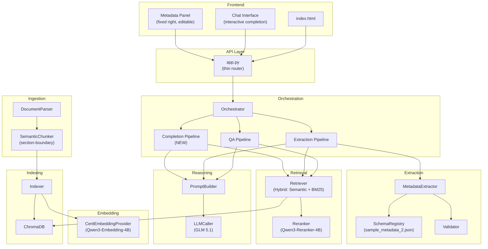

# Implementation Plan v2: Interactive Metadata Extraction Pipeline

## Architecture Overview



---

## Current State Assessment

| Component | Current | Target | Gap |
|---|---|---|---|
| **LLM Model** | `glm-4.7` | `glm-5.1` | Config change |
| **Embedding Model** | `multilingual-e5-large-instruct` (512 tok limit, 1024 dim) | `qwen3-embedding-4b` (8192 tok limit, 2560 dim) | Config + chunk size |
| **Reranker** | Placeholder (pass-through) | `qwen3-reranker-4b` via CERIT API | New implementation |
| **Schema** | `sample_metadata.json` (24 groups, 100+ fields) | `sample_metadata_2.json` (6 groups, 10 fields) | Config change |
| **Chunker** | Token-count overlap (250 tok) | True semantic chunking (section-boundary) | Rewrite |
| **Interactive Completion** | Not implemented | Chat-driven field completion with grounding | New pipeline + API + UI |
| **Metadata Panel** | Basic display only | Editable, collapsible, persistent, live-updating | UI rewrite |
| **Confidence Scoring** | Exists in contract but not surfaced | Full confidence pipeline with evidence | Wire through |

---

## Phased Implementation

### Phase 1 — Model & Config Updates
> *Estimated effort: Small. No logic changes, just wiring.*

**Task 1.1: Update `.env` and `config.py`**
- Change `LLM_MODEL=glm-5.1`
- Change `EMBEDDING_MODEL=qwen3-embedding-4b`
- Change `SCHEMA_PATH` to point at `sample_metadata_2.json`
- Add `RERANKER_MODEL=qwen3-reranker-4b`

**Task 1.2: Update `cerit_embeddings.py`**
- Qwen3-Embedding-4B has an 8192 token context window (vs 512 for e5)
- This removes the chunk-size constraint that forced us to 250 tokens
- Dimension is 2560 — already in `KNOWN_DIMENSIONS`

**Task 1.3: Clear stale vector store**
- Delete `vector_store/` directory (dimension mismatch: 1024 → 2560)

**Files changed:** `.env`, `config.py`, `providers/cerit_embeddings.py`

---

### Phase 2 — Semantic Chunker
> *Estimated effort: Medium. Replaces the current overlap-based chunker.*

**Task 2.1: Rewrite `ingestion/chunker.py` — True Semantic Chunking**

The current chunker uses fixed token-count windows with overlap. The new chunker must:

1. **Split on section headings first** — each major section (Abstract, Methods, Results, etc.) becomes its own chunk boundary. The existing `_detect_section_heading()` patterns are good and should be kept.

2. **Within sections, split on paragraph boundaries** — no mid-paragraph splits. Each paragraph stays intact as a semantic unit.

3. **Apply a soft max-token cap** — if a paragraph exceeds the model limit (8192 tokens for Qwen3-Embedding-4B), only then fall back to sentence-level splitting. The previous 250-token hard cap is removed.

4. **No overlap** — semantic chunks are self-contained. Overlap was a workaround for lost context in fixed-size windows; section-aligned chunks don't need it.

5. **Preserve section metadata** — each `Chunk` carries the section name in its `section` field (already in the contract).

6. **Target chunk size: 500–800 tokens** — sweet spot for retrieval quality. Combine short paragraphs into a single chunk until reaching the target. Never exceed 4000 tokens (practical retrieval quality ceiling even though model supports 8192).

```
Pseudocode:
  sections = split_by_headings(document)
  for section in sections:
    paragraphs = split_by_double_newline(section.text)
    current_chunk = ""
    for para in paragraphs:
      if tokens(current_chunk + para) > TARGET_MAX:
        yield Chunk(current_chunk, section_name)
        current_chunk = para
      else:
        current_chunk += para
    yield Chunk(current_chunk, section_name)  # flush remainder
```

**Files changed:** `ingestion/chunker.py`

---

### Phase 3 — Reranker Integration
> *Estimated effort: Medium. The Qwen3-Reranker-4B model is available at CERIT but does NOT support the embeddings endpoint. It likely uses a cross-encoder scoring pattern.*

**Task 3.1: Implement Qwen3-Reranker-4B in `retrieval/reranker.py`**

Two possible approaches (must test both):

**Approach A — Chat-based reranking:**
Send query + candidate passages to GLM 5.1 and ask it to score/rank them. This is reliable but slower.

**Approach B — Direct reranker API:**
If CERIT exposes a `/v1/rerank` endpoint (LiteLLM supports this for some models), use it directly. Test with:
```python
client.post("/v1/rerank", json={"model": "qwen3-reranker-4b", "query": "...", "documents": [...]})
```

**Implementation:**
- Add `CeritReranker` class that implements scoring
- Integrate into `Retriever.hybrid_query()` — rerank after RRF fusion
- Return top-k reranked results

**Files changed:** `retrieval/reranker.py`, `config.py` (add reranker factory)

---

### Phase 4 — Extraction Pipeline Hardening
> *Estimated effort: Medium. Fix bugs and align with new schema.*

**Task 4.1: Fix `PromptBuilder.build_extraction()` — Schema Compatibility**

Current code references `f['type']` and `f['description']` which don't exist in `sample_metadata_2.json`. The actual fields have `field_type` and `text_values`. Fix the prompt template to use the correct keys.

**Task 4.2: Fix `SchemaRegistry.build_maps()` — Already Fixed**
Verify the `field_groups` parsing is correctly picking up the 6 groups from `sample_metadata_2.json`.

**Task 4.3: Fix `SchemaRegistry.build_index()` — Token-safe schema indexing**
Schema index chunks must stay within Qwen3-Embedding-4B's 8192-token limit. With the new smaller schema (6 groups), this should not be an issue.

**Task 4.4: Update `ExtractionPipeline` — Extract all groups by default**
With only 6 groups in the new schema, there's no need for relevance scoring. Extract all groups on every document upload.

**Files changed:** `reasoning/prompt_builder.py`, `extraction/schema_registry.py`, `orchestration/pipelines.py`

---

### Phase 5 — Interactive Completion Pipeline (Core Feature)
> *Estimated effort: Large. This is the primary new capability.*

**Task 5.1: Add `CompletionPipeline` to `orchestration/pipelines.py`**

This pipeline handles the user's request to fill a specific missing metadata field:

1. User clicks a missing field or asks "What is the soil type?"
2. Pipeline retrieves relevant chunks using field-aware search
3. GLM 5.1 generates a grounded suggestion with:
   - Suggested value (from controlled vocabulary if applicable)
   - Evidence passage from the document
   - Confidence score
   - Inference type (reported vs. inferred)
4. Response is streamed as SSE with a special `field_suggestion` event type
5. UI receives the suggestion and lets user accept/reject/edit

**Task 5.2: Add `PromptBuilder.build_field_completion()`**

New prompt template that:
- Identifies the specific field to complete
- Includes the controlled vocabulary if it's a `TEXT_CHOICE_FIELD`
- Provides document context from retrieved chunks
- Instructs the LLM to suggest ONLY grounded values (no hallucination)
- Returns structured JSON with value, evidence, confidence

**Task 5.3: Add new API endpoint `POST /api/suggest`**

Request body:
```json
{
  "field_name": "soil_type",
  "group_name": "local environment conditions: soil",
  "user_context": "optional user hint"
}
```

Response (SSE):
```json
{
  "field_suggestion": {
    "field_name": "soil_type",
    "suggested_value": "Chernozem",
    "confidence": "medium",
    "evidence": "The study site is located in the Chernozem belt of South Moravia...",
    "inference_type": "inferred",
    "alternatives": ["Luvisol", "Phaeozem"]
  }
}
```

**Task 5.4: Add `POST /api/metadata/update` endpoint**

Allows the frontend to persist user-accepted or manually-edited metadata values back to the session:
```json
{
  "group_name": "local environment conditions: soil",
  "field_name": "soil_type",
  "value": "Chernozem",
  "source": "user_accepted"
}
```

**Files changed:** `orchestration/pipelines.py`, `reasoning/prompt_builder.py`, `app.py`, `orchestration/orchestrator.py`

---

### Phase 6 — UI Redesign
> *Estimated effort: Large. Complete rewrite of metadata panel and chat interaction.*

**Task 6.1: Metadata Panel — Fixed Right, Editable**

Requirements:
- Panel remains **fixed** on the right side (not hidden by default)
- **Expand/Collapse** toggle per group AND global expand/collapse all
- Each field displays: field name, value (or "missing"), confidence badge, evidence toggle
- **Missing fields** are highlighted with a distinct style (e.g., amber border, "Click to suggest" button)
- Fields are **directly editable** — clicking a value turns it into an input/select
- For `TEXT_CHOICE_FIELD`, render a dropdown with the controlled vocabulary
- For `TEXT_FIELD`, render a text input

**Task 6.2: Interactive Completion Flow in UI**

When user clicks "Suggest" on a missing field:
1. UI calls `POST /api/suggest` with the field details
2. A chat message appears: "🔍 Searching for evidence about *soil_type*..."
3. The LLM response streams into the chat with the suggestion
4. The metadata panel shows a pending value with "Accept" / "Reject" / "Edit" buttons
5. On "Accept", the value is committed to session state via `POST /api/metadata/update`
6. On "Edit", the field becomes an input pre-filled with the suggestion

**Task 6.3: Dynamic Metadata Updates**

- After initial extraction, metadata panel populates with all fields (filled + missing)
- During chat Q&A, if the LLM response mentions a field value, it's detected by the post-response extraction and the panel updates live
- Panel shows a subtle animation when a field is updated

**Task 6.4: Download / Export**

- Existing download button exports current metadata state as JSON
- Add option to export only filled fields
- Include audit trail (who filled each field: "auto-extracted" vs "user-provided" vs "ai-suggested")

**Files changed:** `templates/index.html`, `static/style.css`

---

### Phase 7 — Auto-Extraction on Upload
> *Estimated effort: Small. Wiring change.*

**Task 7.1: Trigger extraction automatically after document upload**

After successful upload + indexing, automatically run the `ExtractionPipeline` and return results in the upload response. This removes the need for users to manually request extraction.

The upload response becomes:
```json
{
  "message": "Processed 12 chunks",
  "filename": "manuscript.pdf",
  "session_id": "...",
  "metadata": { ... extracted fields ... },
  "diagnostics": { ... }
}
```

**Files changed:** `app.py`

---

### Phase 8 — Testing & Validation
> *Estimated effort: Medium.*

**Task 8.1: Update `test_integration.py`**
- Test with Qwen3-Embedding-4B (2560 dim)
- Test with GLM 5.1
- Test extraction against `sample_metadata_2.json`
- Test interactive completion for a missing field
- Test manual metadata update

**Task 8.2: Test reranker**
- Verify reranker improves retrieval quality on a known document

**Task 8.3: Clean up test files**
- Remove stale test scripts: `test_model.py`, `test_embeddings.py`, `test_large_upload.py`, `test_upload.py`, `check_schema_size.py`, `list_models.py`

**Files changed:** `test_integration.py`, delete stale test files

---

## Execution Order & Dependencies

```mermaid
gantt
    title Implementation Sequence
    dateFormat X
    axisFormat %s

    section Phase 1
    Config + Model Updates        :p1, 0, 1
    
    section Phase 2
    Semantic Chunker              :p2, after p1, 2
    
    section Phase 3
    Reranker Integration          :p3, after p1, 2
    
    section Phase 4
    Extraction Hardening          :p4, after p2, 1
    
    section Phase 5
    Completion Pipeline           :p5, after p4, 3
    
    section Phase 6
    UI Redesign                   :p6, after p5, 3
    
    section Phase 7
    Auto-Extract on Upload        :p7, after p6, 1
    
    section Phase 8
    Testing                       :p8, after p7, 1
```



> [!IMPORTANT]
> **Phase 1 must be done first** — all subsequent phases depend on the correct model configuration.
> **Phases 2 and 3 are independent** and can be done in parallel.
> **Phase 5 depends on Phase 4** — the extraction must work before interactive completion can extend it.

---

## Behavioral Constraints (Enforced in Prompts)

| Constraint | Enforcement Point |
|---|---|
| No hallucinated values | `PromptBuilder.build_field_completion()` — system prompt includes: "ONLY suggest values that can be traced to specific passages in the document" |
| Controlled vocabulary compliance | `Validator.validate()` — fuzzy-matches against `text_values` for `TEXT_CHOICE_FIELD` |
| Confidence scoring | `FieldExtraction.confidence` — high/medium/low based on evidence directness |
| Grounded suggestions | Retriever provides evidence passages; LLM must cite them |
| Inference type tracking | `FieldExtraction.inference_type` — "reported" vs "inferred" |
| Audit trail | `FieldExtraction` extended with `source` field: "auto-extracted" / "ai-suggested" / "user-provided" |

---

## File Change Summary

| File | Phase | Action |
|---|---|---|
| `.env` | 1 | Update model names |
| `config.py` | 1, 3 | Update defaults, add reranker factory |
| `providers/cerit_embeddings.py` | 1 | Verify Qwen3 entry |
| `ingestion/chunker.py` | 2 | Rewrite to semantic chunking |
| `retrieval/reranker.py` | 3 | Implement Qwen3-Reranker-4B |
| `reasoning/prompt_builder.py` | 4, 5 | Fix extraction, add completion prompt |
| `extraction/schema_registry.py` | 4 | Verify schema parsing |
| `orchestration/pipelines.py` | 4, 5 | Fix extraction, add CompletionPipeline |
| `orchestration/orchestrator.py` | 5 | Add completion mode detection |
| `app.py` | 5, 7 | Add `/api/suggest`, `/api/metadata/update`, auto-extract |
| `core/contracts.py` | 5 | Add `source` to FieldExtraction |
| `templates/index.html` | 6 | Full UI redesign |
| `static/style.css` | 6 | Updated styles |
| `test_integration.py` | 8 | Updated tests |
