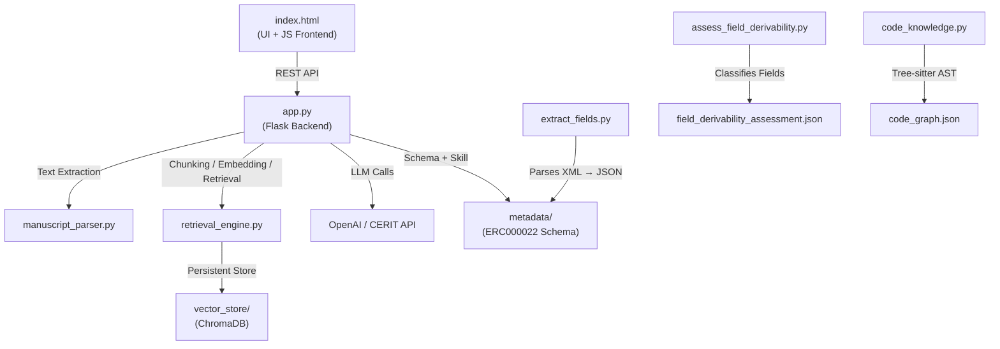
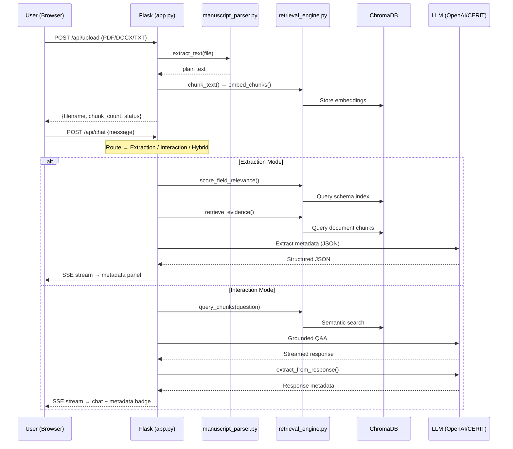

# 🌿 Document Research Assistant — Project Working Tree

**Repository:** `BioIT-CEITEC/document-research-assistant`  
**Project Root:** `/mnt/f/Collab/plant_breeding/code`  
**Generated:** May 5, 2026

---

## Architecture Overview



---

## Directory Tree

```
code/
├── .agent/                          # 🤖 Agent configuration (gitignored)
│   ├── rules/
│   │   └── wsl_environment.md       # WSL runtime rules — enforces /mnt/f/ paths and venv usage
│   └── skills/
│       ├── ai-agents-architect.md   # Skill: ReAct/Plan-Execute agent design patterns
│       ├── bdistill-knowledge-extraction.md  # Skill: Structured knowledge extraction from LLMs
│       ├── biopython.md             # Skill: Biopython reference — SeqIO, Entrez, BLAST, PDB
│       ├── brainstorming.md         # Skill: Structured brainstorming → validated design process
│       ├── llm-application-dev-ai-assistant.md     # Skill: AI chatbot/assistant development
│       └── llm-application-dev-prompt-optimize.md  # Skill: Prompt engineering best practices
│
├── documents/                       # 📄 Uploaded manuscripts (gitignored)
│   ├── *.pdf                        # Scientific manuscript PDFs (user uploads + samples)
│   ├── crop_development_factors.docx
│   └── doc_1.docx
│
├── fasta_file/                      # 🧬 Raw sequencing data (gitignored)
│   ├── SRR3932411.sh                # Download script for paired-end FASTQ from EBI FTP
│   ├── SRR3932411_1.fastq.gz        # Forward reads (~3.7 GB)
│   └── SRR3932411_2.fastq.gz        # Reverse reads (~3.8 GB)
│
├── flask_session/                   # 🔐 Server-side session files (gitignored)
│   └── <session_hash_files>         # Flask-Session filesystem backend
│
├── metadata/                        # 📋 Extraction schema & rules
│   ├── ERC000022.xml                # ENA environmental sample checklist (source XML)
│   ├── sample_metadata.json         # Parsed schema: field groups, types, controlled vocabularies
│   └── extraction_skill.md          # LLM extraction skill: 568 lines of strategies, trigger
│                                    #   phrases, unit-anchored extraction, encoding recovery
│
├── sample/                          # 🧪 Sample test documents
│   ├── sample_2.pdf                 # Real scientific manuscript for testing
│   └── synthetic_manuscript_1.pdf   # Synthetic manuscript for controlled testing
│
├── static/                          # 🎨 Frontend assets
│   └── style.css                    # Full UI stylesheet — dark theme, glassmorphism, animations
│
├── templates/                       # 🖥️ Jinja2 templates
│   └── index.html                   # Single-page app: chat interface + metadata side panel
│                                    #   (629 lines — JS handles SSE streaming, metadata rendering)
│
├── vector_store/                    # 💾 ChromaDB persistent storage (gitignored)
│   ├── chroma.sqlite3               # ChromaDB SQLite backend (~3.9 MB)
│   └── <uuid_dirs>/                 # Embedding collections per session
│
│── ─── Python Modules ─────────────────────────────────────────────
│
├── app.py                           # ⚙️ MAIN ENTRY — Flask backend (595 lines)
│                                    #   Routes: /, /api/schema, /api/upload, /api/chat, /api/session
│                                    #   Tri-modal system: Extraction / Interaction / Hybrid
│                                    #   SSE streaming, schema validation, fuzzy vocab matching,
│                                    #   post-response metadata extraction, dynamic top-k retrieval
│
├── retrieval_engine.py              # 🔍 RAG engine (300 lines)
│                                    #   Section-aware recursive text chunker (tiktoken cl100k_base)
│                                    #   ChromaDB embedding/storage (OpenAI text-embedding-3-small)
│                                    #   Schema field semantic indexing for relevance scoring
│                                    #   Evidence retrieval for targeted field extraction
│
├── manuscript_parser.py             # 📖 Document parser (70 lines)
│                                    #   Extracts plain text from PDF (PyMuPDF), DOCX (python-docx),
│                                    #   TXT (with chardet encoding detection). 10 MB file size limit.
│
├── extract_fields.py                # 🏗️ XML schema parser (165 lines)
│                                    #   Parses ERC000022.xml → structured JSON: field groups, names,
│                                    #   types (TEXT_FIELD / TEXT_CHOICE_FIELD), controlled vocabularies.
│                                    #   Output: sample_metadata.json
│
├── assess_field_derivability.py     # 🧪 Field derivability classifier (1040 lines)
│                                    #   Classifies 109 ERC000022 fields into:
│                                    #     • Directly Available (45 fields, 41.3%)
│                                    #     • Inferable via bioinformatics (37 fields, 33.9%)
│                                    #     • Not Obtainable from sequences (27 fields, 24.8%)
│                                    #   Outputs: field_derivability_assessment.json
│
├── code_knowledge.py                # 🗺️ Structural code graph builder (158 lines)
│                                    #   Uses tree-sitter to parse Python AST → extract functions,
│                                    #   classes, methods, and import edges. Codebase navigation only,
│                                    #   NOT part of the document pipeline. Output: code_graph.json
│
├── generate_html.py                 # 📊 Graph visualizer (30 lines)
│                                    #   Converts code_graph.json → interactive HTML using graphify
│                                    #   (build_from_json → cluster → to_html)
│
│── ─── Test Scripts ────────────────────────────────────────────────
│
├── test_model.py                    # 🧪 LLM API smoke test — calls CERIT GLM-5.1 endpoint
├── test_parser.py                   # 🧪 Parser unit test — validates PDF text extraction
├── test_script.py                   # 🧪 Integration test — uploads document + streams chat response
│
│── ─── Configuration & Documentation ──────────────────────────────
│
├── .env                             # 🔑 Environment variables (gitignored)
│                                    #   OPENAI_API_KEY, CERIT_API_KEY, CERIT_BASE_URL,
│                                    #   LLM_PROVIDER, LLM_MODEL
│
├── .gitignore                       # Git exclusions: .agent/, documents/, fasta_file/,
│                                    #   flask_session/, vector_store/, .env, __pycache__/
│
├── requirements.txt                 # Python deps: flask, openai, chromadb, tiktoken,
│                                    #   PyMuPDF, python-docx, chardet, python-dotenv, flask-session
│
├── README.md                        # Project description: plant sequencing + ENA integration
│
│── ─── Generated Reports ──────────────────────────────────────────
│
├── code_graph.json                  # AST-derived structural graph of the codebase
├── field_derivability_assessment.json  # 109-field derivability classification with reasoning
├── FIELD_DERIVABILITY_SUMMARY.md    # Human-readable derivability report (gitignored)
└── QUICK_REFERENCE.md               # Quick-lookup derivability matrix (gitignored)
```

---

## File Summaries

### Core Application

| File | Lines | Purpose |
|------|------:|---------|
| [app.py](file:///f:/Collab/plant_breeding/code/app.py) | 595 | **Flask backend** — Tri-modal document research assistant. Handles file uploads, SSE-streamed chat (Interaction / Extraction / Hybrid modes), schema-driven metadata extraction with field relevance scoring, fuzzy vocabulary matching, and post-response metadata extraction from LLM answers. |
| [retrieval_engine.py](file:///f:/Collab/plant_breeding/code/retrieval_engine.py) | 300 | **RAG engine** — Section-aware recursive text chunker using tiktoken, ChromaDB for vector storage with OpenAI embeddings, semantic schema index for field relevance scoring, and batched evidence retrieval for extraction. |
| [manuscript_parser.py](file:///f:/Collab/plant_breeding/code/manuscript_parser.py) | 70 | **Document parser** — Extracts plain text from PDF (PyMuPDF), DOCX (python-docx), and TXT (chardet) with a 10 MB size limit. |

### Schema & Analysis Tools

| File | Lines | Purpose |
|------|------:|---------|
| [extract_fields.py](file:///f:/Collab/plant_breeding/code/extract_fields.py) | 165 | **XML schema parser** — Extracts structured field definitions from the ERC000022 checklist XML into JSON with field groups, names, types, and controlled vocabularies. |
| [assess_field_derivability.py](file:///f:/Collab/plant_breeding/code/assess_field_derivability.py) | 1040 | **Derivability classifier** — Classifies all 109 ERC000022 fields by whether they can be derived from raw FASTQ sequencing data (Directly Available / Inferable / Not Obtainable). |
| [code_knowledge.py](file:///f:/Collab/plant_breeding/code/code_knowledge.py) | 158 | **Code graph builder** — Uses tree-sitter to parse Python ASTs and extract functions, classes, methods, and import relationships into a structural JSON graph. |
| [generate_html.py](file:///f:/Collab/plant_breeding/code/generate_html.py) | 30 | **Graph visualizer** — Converts the code graph JSON into an interactive HTML visualization using graphify. |

### Frontend

| File | Lines | Purpose |
|------|------:|---------|
| [index.html](file:///f:/Collab/plant_breeding/code/templates/index.html) | 629 | **Single-page UI** — Chat interface with SSE streaming, file upload, metadata side panel with collapsible field groups, confidence badges, evidence drill-down, and JSON export. Uses Inter font + dark theme. |
| [style.css](file:///f:/Collab/plant_breeding/code/static/style.css) | ~300 | **Stylesheet** — Dark theme with CSS variables, glassmorphism effects, typing animations, responsive layout for chat + side panel. |

### Metadata & Skills

| File | Purpose |
|------|---------|
| [ERC000022.xml](file:///f:/Collab/plant_breeding/code/metadata/ERC000022.xml) | Source XML for the ENA environmental sample checklist — 109 fields across 20+ groups. |
| [sample_metadata.json](file:///f:/Collab/plant_breeding/code/metadata/sample_metadata.json) | Parsed schema JSON: field groups, field types (TEXT_FIELD / TEXT_CHOICE_FIELD), and controlled vocabulary lists. |
| [extraction_skill.md](file:///f:/Collab/plant_breeding/code/metadata/extraction_skill.md) | 568-line LLM extraction guide: 7 extraction strategies, trigger phrase recognition, unit-anchored extraction, encoding recovery, negative evidence, and controlled vocabulary matching. |

### Test Scripts

| File | Purpose |
|------|---------|
| [test_model.py](file:///f:/Collab/plant_breeding/code/test_model.py) | Smoke test for the CERIT LLM API endpoint (GLM-5.1). |
| [test_parser.py](file:///f:/Collab/plant_breeding/code/test_parser.py) | Quick validation that PDF text extraction works on a synthetic manuscript. |
| [test_script.py](file:///f:/Collab/plant_breeding/code/test_script.py) | End-to-end integration test: uploads a PDF, sends a chat question, streams the SSE response. |

### Generated Reports

| File | Purpose |
|------|---------|
| [FIELD_DERIVABILITY_SUMMARY.md](file:///f:/Collab/plant_breeding/code/FIELD_DERIVABILITY_SUMMARY.md) | Comprehensive 345-line report on which ERC000022 fields can be derived from raw FASTQ data. |
| [QUICK_REFERENCE.md](file:///f:/Collab/plant_breeding/code/QUICK_REFERENCE.md) | Quick-lookup matrix for field derivability: ✅ Available / ⚠️ Inferable / ❌ Not Obtainable. |
| [code_graph.json](file:///f:/Collab/plant_breeding/code/code_graph.json) | Structural graph of the codebase (functions, classes, imports) generated by tree-sitter. |
| [field_derivability_assessment.json](file:///f:/Collab/plant_breeding/code/field_derivability_assessment.json) | Detailed JSON classification of all 109 fields with reasoning and requirements. |

---

## Data Flow



---

## Technology Stack

| Layer | Technology |
|-------|-----------|
| **Backend** | Python 3.12, Flask, Flask-Session |
| **LLM** | OpenAI GPT-4o / CERIT GLM-4.7 (configurable via `.env`) |
| **Embeddings** | OpenAI `text-embedding-3-small` |
| **Vector DB** | ChromaDB (persistent, SQLite backend) |
| **Tokenizer** | tiktoken (`cl100k_base`) |
| **PDF Parser** | PyMuPDF (fitz) |
| **DOCX Parser** | python-docx |
| **Encoding Detection** | chardet |
| **Code Analysis** | tree-sitter (Python grammar) |
| **Frontend** | Vanilla HTML/CSS/JS, Inter font, Marked.js (Markdown rendering) |
